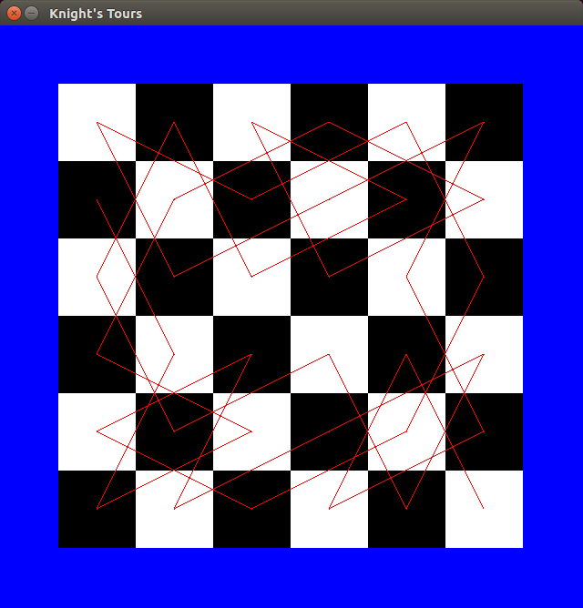
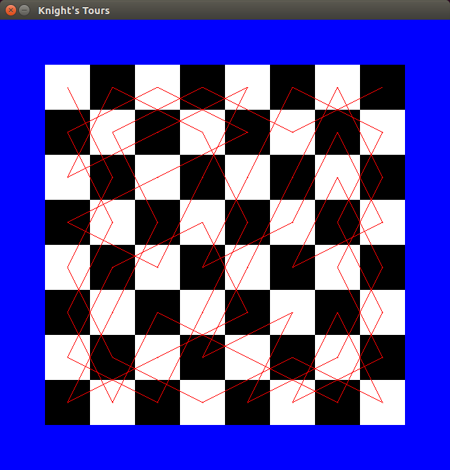

# KnightsTour
A Knight's Tour is a sequence of knight moves which visits each square on the board exactly once.

This code performs a brute force enumeration of Knight's Tours with graphics.

The graphical display requires SDL 1.x to be installed.

# Performance
I've used a few tricks to try and improve the performance of the search including:
- Checking connectivity after each knight move (most expensive operation)
- Using symmetries

The program is capable of enumerating all Knight's Tours on a 6x6 board in a few minutes on fairly low-end hardware (there are 6,637,920 of them!)

The next step (unless I can think of further algorithmic improvements) is to parallelise the search.

# Next Features
- Support rectangular boards (currently square boards only)
- Enumerate Eulerian Tours

# Examples

